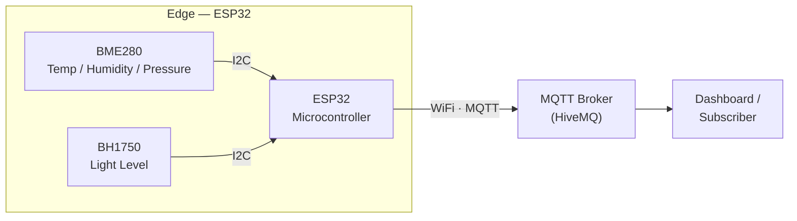
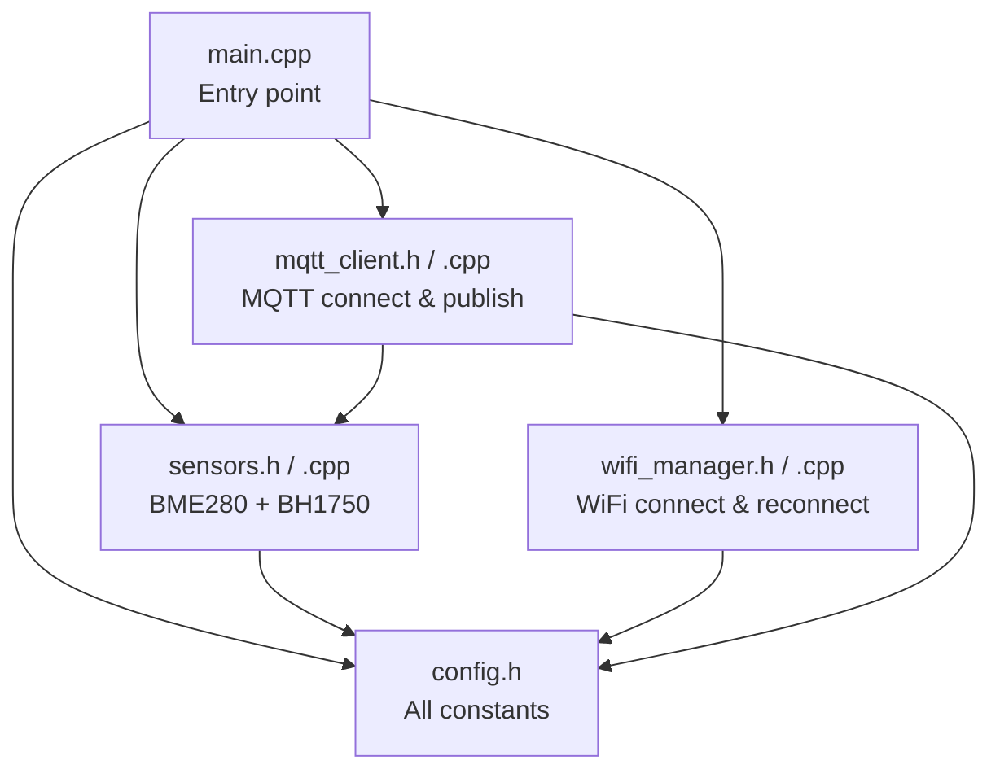
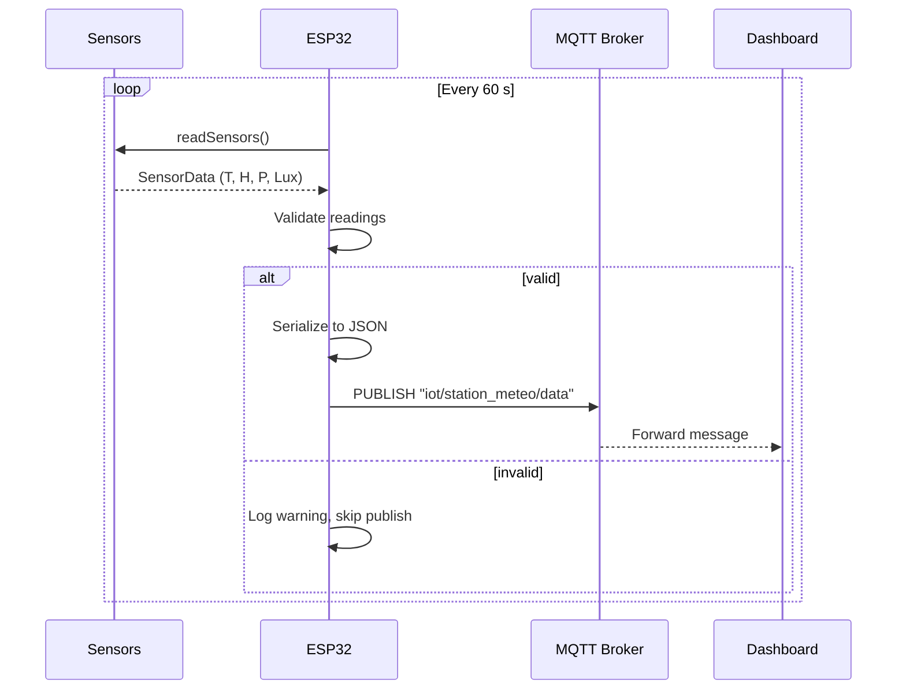

# Connected Weather Station — Architecture

## System Overview



## Software Module Diagram



## Data Flow



## Project Structure

```
Connected-Weather-Station/
├── platformio.ini          # Build config & library deps
├── include/
│   ├── config.h            # WiFi, MQTT, pin & timing constants
│   ├── sensors.h           # Sensor interface (SensorData struct)
│   ├── wifi_manager.h      # WiFi connect / reconnect
│   └── mqtt_client.h       # MQTT connect / publish
├── src/
│   ├── main.cpp            # setup() + loop()
│   ├── sensors.cpp         # BME280 & BH1750 implementation
│   ├── wifi_manager.cpp    # WiFi implementation
│   └── mqtt_client.cpp     # MQTT implementation
├── docs/
│   ├── architecture.md     # This file
│   └── wiring_diagram.png  # Hardware wiring schematic
└── README.md
```

## Hardware

| Component    | Role                            | Interface        | Address |
| ------------ | ------------------------------- | ---------------- | ------- |
| ESP32 DevKit | Microcontroller                 | —                | —       |
| BME280       | Temperature, Humidity, Pressure | I2C (GPIO 21/22) | 0x76    |
| BH1750       | Ambient Light                   | I2C (GPIO 21/22) | 0x23    |

## MQTT Payload

```json
{
  "temperature": 23.5,
  "humidity": 45.2,
  "pressure": 1013.25,
  "lux": 350.0
}
```

Topic: `iot/station_meteo/data`
